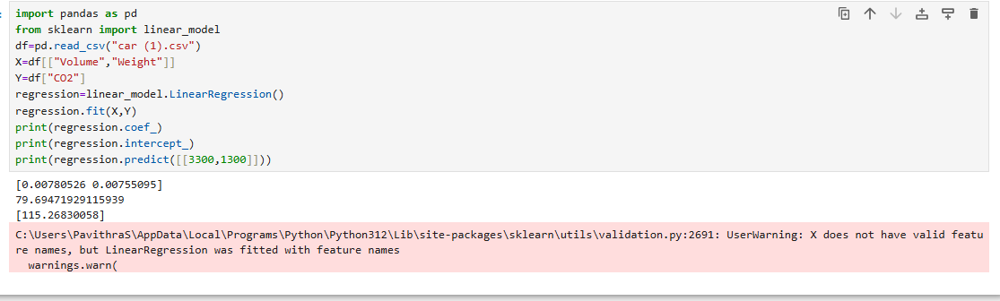

# Implementation of Multivariate Linear Regression
## Aim
To write a python program to implement multivariate linear regression and predict the output.
## Equipment’s required:
1.	Hardware – PCs
2.	Anaconda – Python 3.7 Installation / Moodle-Code Runner
## Algorithm:
### Step1
<br>

### Step2
<br>

### Step3
<br>

### Step4
<br>

### Step5
<br>

## Program:
```
Developed By: Pavithra S
Register No: 212225040298//25017175
import pandas as pd
from sklearn import linear_model
df=pd.read_csv("car (1).csv")
X=df[["Volume","Weight"]]
Y=df["CO2"]
regression=linear_model.LinearRegression()
regression.fit(X,Y)
print(regression.coef_)
print(regression.intercept_)
print(regression.predict([[3300,1300]]))

```
## Output:


<br>

## Result
Thus the multivariate linear regression is implemented and predicted the output using python program.